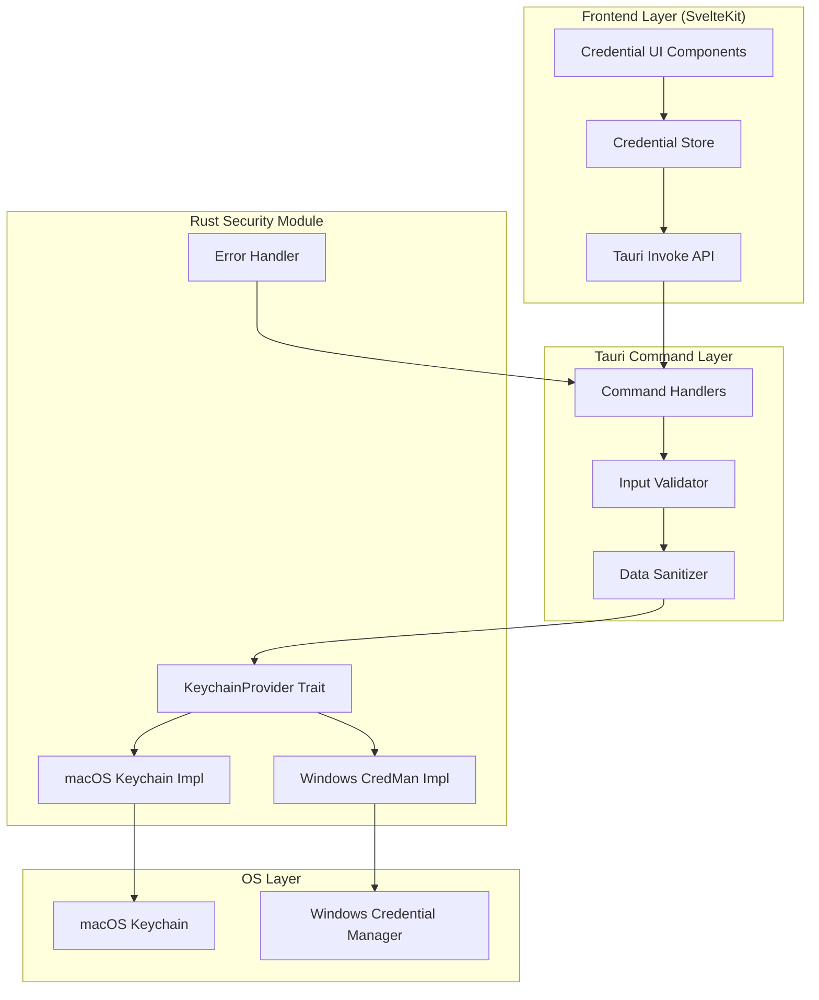
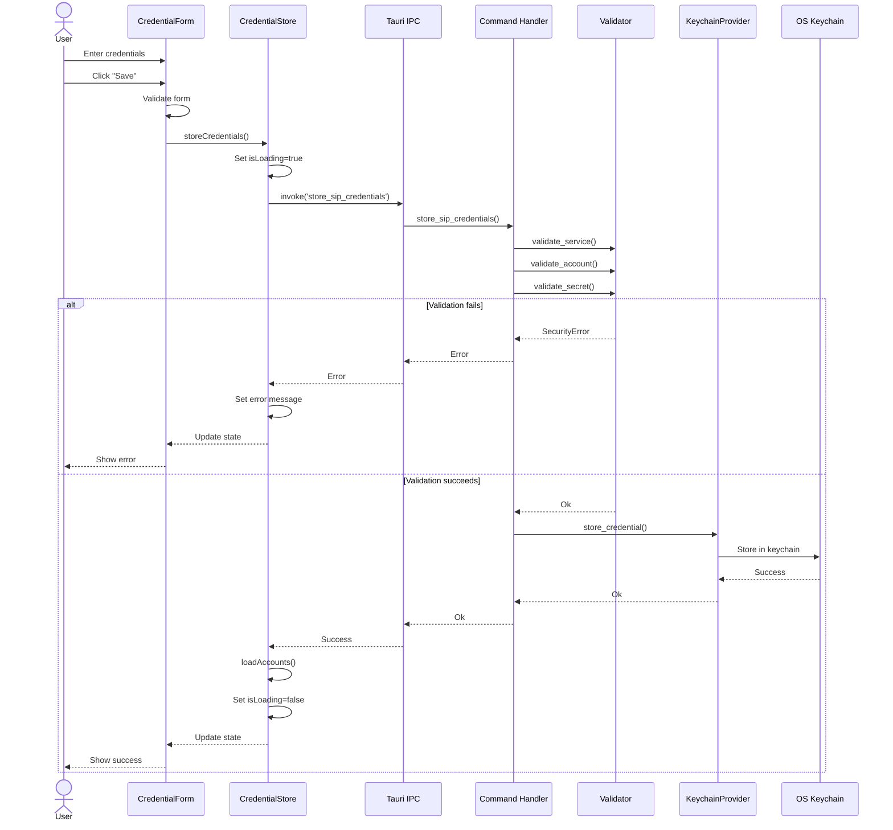
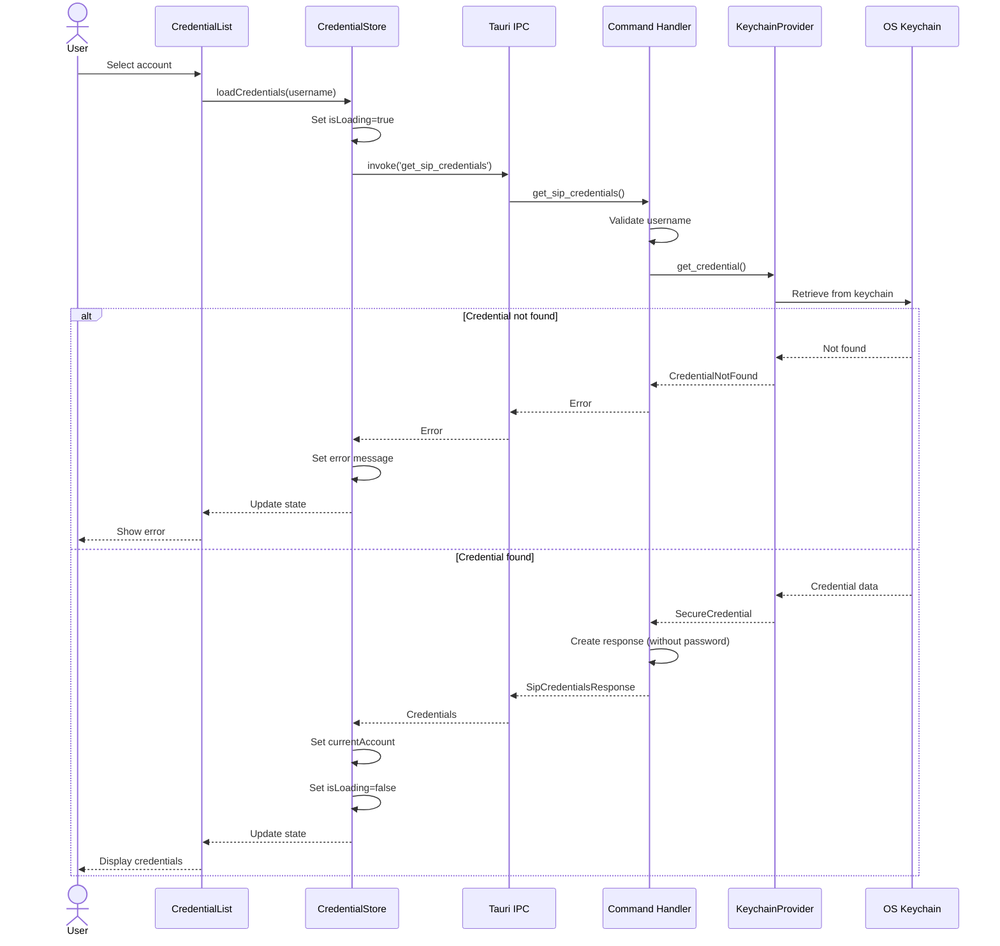
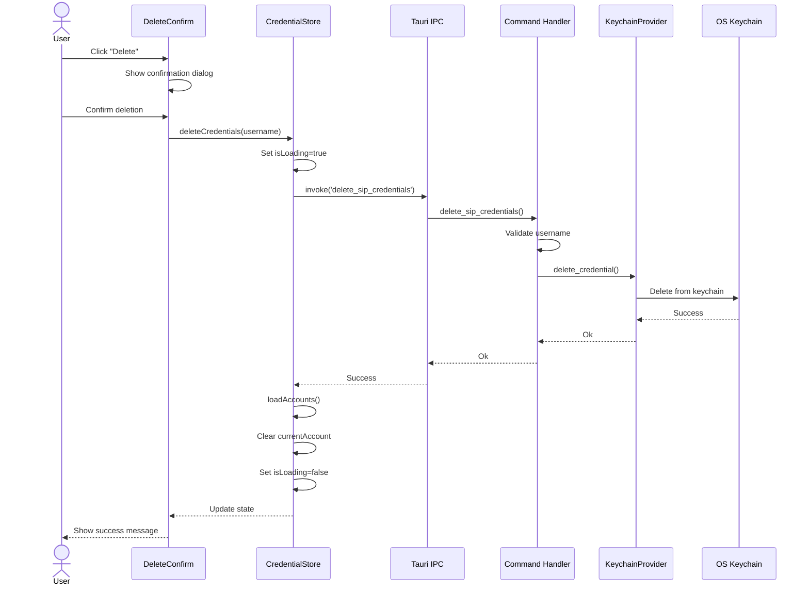

# Security & Storage Architecture Design

## Document Metadata

- **Component**: Security & Credential Storage
- **Status**: Architecture Phase (SPARC)
- **Last Updated**: 2025-10-11
- **Target Platforms**: macOS (Keychain), Windows (Credential Manager)

---

## 1. System Overview

The Security & Storage subsystem provides secure credential management for RUSTALK, leveraging platform-native keychains to store SIP credentials, API keys, and sensitive configuration data.

### Design Principles

1. **Platform-Native**: Use OS-provided credential storage (Keychain/Credential Manager)
2. **Zero Plaintext**: Never store credentials in plaintext or configuration files
3. **Defense in Depth**: Multiple layers of validation and sanitization
4. **Fail Securely**: Default to denial on errors
5. **Minimal Surface**: Expose only necessary operations via Tauri commands

---

## 2. High-Level Architecture



---

## 3. Rust Module Structure

### Directory Layout

```
src-tauri/src/
├── security/
│   ├── mod.rs              # Module exports and public API
│   ├── keychain.rs         # KeychainProvider trait
│   ├── error.rs            # Error types and conversions
│   ├── validation.rs       # Input validation logic
│   ├── sanitization.rs     # Data sanitization
│   ├── platform/
│   │   ├── mod.rs          # Platform selection
│   │   ├── macos.rs        # macOS Keychain implementation
│   │   ├── windows.rs      # Windows Credential Manager implementation
│   │   └── test_mock.rs    # Mock implementation for testing
│   └── types.rs            # Common types and structs
├── commands/
│   └── security.rs         # Tauri command handlers
└── lib.rs                  # Module registration
```

### Core Trait Definition

```rust
// src-tauri/src/security/keychain.rs

use async_trait::async_trait;
use serde::{Deserialize, Serialize};
use crate::security::error::SecurityResult;

/// Credential storage record
#[derive(Debug, Clone, Serialize, Deserialize)]
pub struct Credential {
    /// Unique identifier for the credential
    pub service: String,
    /// Account/username
    pub account: String,
    /// Credential attributes (e.g., SIP server, port)
    #[serde(default)]
    pub attributes: HashMap<String, String>,
}

/// Secure credential data (not serialized in logs)
#[derive(Debug, Clone)]
pub struct SecureCredential {
    pub credential: Credential,
    /// Secret value (password, token, etc.)
    #[serde(skip_serializing)]
    pub secret: String,
}

/// Platform-agnostic keychain provider trait
#[async_trait]
pub trait KeychainProvider: Send + Sync {
    /// Store a credential securely
    async fn store_credential(
        &self,
        credential: &SecureCredential,
    ) -> SecurityResult<()>;

    /// Retrieve a credential by service and account
    async fn get_credential(
        &self,
        service: &str,
        account: &str,
    ) -> SecurityResult<SecureCredential>;

    /// List all credentials for a service
    async fn list_credentials(
        &self,
        service: &str,
    ) -> SecurityResult<Vec<Credential>>;

    /// Update an existing credential
    async fn update_credential(
        &self,
        service: &str,
        account: &str,
        new_credential: &SecureCredential,
    ) -> SecurityResult<()>;

    /// Delete a credential
    async fn delete_credential(
        &self,
        service: &str,
        account: &str,
    ) -> SecurityResult<()>;

    /// Check if a credential exists
    async fn credential_exists(
        &self,
        service: &str,
        account: &str,
    ) -> SecurityResult<bool>;
}

/// Factory function for platform-specific provider
pub fn create_keychain_provider() -> Box<dyn KeychainProvider> {
    #[cfg(target_os = "macos")]
    {
        Box::new(platform::MacOSKeychain::new())
    }

    #[cfg(target_os = "windows")]
    {
        Box::new(platform::WindowsCredentialManager::new())
    }

    #[cfg(not(any(target_os = "macos", target_os = "windows")))]
    {
        compile_error!("Unsupported platform for credential storage")
    }
}
```

### Error Types

```rust
// src-tauri/src/security/error.rs

use thiserror::Error;

#[derive(Error, Debug)]
pub enum SecurityError {
    #[error("Credential not found: {service}/{account}")]
    CredentialNotFound {
        service: String,
        account: String,
    },

    #[error("Credential already exists: {service}/{account}")]
    CredentialAlreadyExists {
        service: String,
        account: String,
    },

    #[error("Invalid input: {field} - {reason}")]
    InvalidInput {
        field: String,
        reason: String,
    },

    #[error("Platform keychain error: {0}")]
    PlatformError(String),

    #[error("Access denied: {0}")]
    AccessDenied(String),

    #[error("Data corruption detected: {0}")]
    DataCorruption(String),

    #[error("IO error: {0}")]
    IoError(#[from] std::io::Error),

    #[error("Serialization error: {0}")]
    SerializationError(#[from] serde_json::Error),
}

pub type SecurityResult<T> = Result<T, SecurityError>;

impl From<SecurityError> for String {
    fn from(err: SecurityError) -> String {
        err.to_string()
    }
}

// Convert to Tauri error
impl From<SecurityError> for tauri::Error {
    fn from(err: SecurityError) -> Self {
        tauri::Error::FailedToExecuteApi(err.to_string())
    }
}
```

### Validation Module

```rust
// src-tauri/src/security/validation.rs

use crate::security::error::{SecurityError, SecurityResult};
use regex::Regex;
use once_cell::sync::Lazy;

/// Maximum lengths for security fields
const MAX_SERVICE_LENGTH: usize = 256;
const MAX_ACCOUNT_LENGTH: usize = 256;
const MAX_SECRET_LENGTH: usize = 4096;
const MAX_ATTRIBUTE_KEY_LENGTH: usize = 128;
const MAX_ATTRIBUTE_VALUE_LENGTH: usize = 1024;

/// Valid service name pattern (alphanumeric, dash, underscore, dot)
static SERVICE_PATTERN: Lazy<Regex> =
    Lazy::new(|| Regex::new(r"^[a-zA-Z0-9._-]+$").unwrap());

/// Valid account name pattern (email or alphanumeric with special chars)
static ACCOUNT_PATTERN: Lazy<Regex> =
    Lazy::new(|| Regex::new(r"^[a-zA-Z0-9._%+@-]+$").unwrap());

pub struct Validator;

impl Validator {
    /// Validate service name
    pub fn validate_service(service: &str) -> SecurityResult<()> {
        if service.is_empty() {
            return Err(SecurityError::InvalidInput {
                field: "service".to_string(),
                reason: "Service name cannot be empty".to_string(),
            });
        }

        if service.len() > MAX_SERVICE_LENGTH {
            return Err(SecurityError::InvalidInput {
                field: "service".to_string(),
                reason: format!("Service name exceeds {} characters", MAX_SERVICE_LENGTH),
            });
        }

        if !SERVICE_PATTERN.is_match(service) {
            return Err(SecurityError::InvalidInput {
                field: "service".to_string(),
                reason: "Service name contains invalid characters".to_string(),
            });
        }

        Ok(())
    }

    /// Validate account name
    pub fn validate_account(account: &str) -> SecurityResult<()> {
        if account.is_empty() {
            return Err(SecurityError::InvalidInput {
                field: "account".to_string(),
                reason: "Account name cannot be empty".to_string(),
            });
        }

        if account.len() > MAX_ACCOUNT_LENGTH {
            return Err(SecurityError::InvalidInput {
                field: "account".to_string(),
                reason: format!("Account name exceeds {} characters", MAX_ACCOUNT_LENGTH),
            });
        }

        if !ACCOUNT_PATTERN.is_match(account) {
            return Err(SecurityError::InvalidInput {
                field: "account".to_string(),
                reason: "Account name contains invalid characters".to_string(),
            });
        }

        Ok(())
    }

    /// Validate secret value
    pub fn validate_secret(secret: &str) -> SecurityResult<()> {
        if secret.is_empty() {
            return Err(SecurityError::InvalidInput {
                field: "secret".to_string(),
                reason: "Secret cannot be empty".to_string(),
            });
        }

        if secret.len() > MAX_SECRET_LENGTH {
            return Err(SecurityError::InvalidInput {
                field: "secret".to_string(),
                reason: format!("Secret exceeds {} characters", MAX_SECRET_LENGTH),
            });
        }

        // Check for null bytes (can cause issues in C FFI)
        if secret.contains('\0') {
            return Err(SecurityError::InvalidInput {
                field: "secret".to_string(),
                reason: "Secret contains invalid null bytes".to_string(),
            });
        }

        Ok(())
    }

    /// Validate credential attributes
    pub fn validate_attributes(
        attributes: &HashMap<String, String>
    ) -> SecurityResult<()> {
        for (key, value) in attributes {
            if key.len() > MAX_ATTRIBUTE_KEY_LENGTH {
                return Err(SecurityError::InvalidInput {
                    field: format!("attribute.{}", key),
                    reason: format!("Key exceeds {} characters", MAX_ATTRIBUTE_KEY_LENGTH),
                });
            }

            if value.len() > MAX_ATTRIBUTE_VALUE_LENGTH {
                return Err(SecurityError::InvalidInput {
                    field: format!("attribute.{}", key),
                    reason: format!("Value exceeds {} characters", MAX_ATTRIBUTE_VALUE_LENGTH),
                });
            }
        }

        Ok(())
    }

    /// Validate complete credential
    pub fn validate_credential(cred: &SecureCredential) -> SecurityResult<()> {
        Self::validate_service(&cred.credential.service)?;
        Self::validate_account(&cred.credential.account)?;
        Self::validate_secret(&cred.secret)?;
        Self::validate_attributes(&cred.credential.attributes)?;
        Ok(())
    }
}
```

---

## 4. Platform Implementations

### macOS Keychain Implementation

```rust
// src-tauri/src/security/platform/macos.rs

use async_trait::async_trait;
use security_framework::passwords::{
    set_generic_password,
    get_generic_password,
    delete_generic_password,
};
use crate::security::{
    KeychainProvider,
    SecureCredential,
    Credential,
    SecurityResult,
    SecurityError,
};

pub struct MacOSKeychain;

impl MacOSKeychain {
    pub fn new() -> Self {
        Self
    }
}

#[async_trait]
impl KeychainProvider for MacOSKeychain {
    async fn store_credential(
        &self,
        credential: &SecureCredential,
    ) -> SecurityResult<()> {
        let service = &credential.credential.service;
        let account = &credential.credential.account;
        let secret = credential.secret.as_bytes();

        // Store the password
        set_generic_password(service, account, secret)
            .map_err(|e| SecurityError::PlatformError(
                format!("macOS Keychain error: {}", e)
            ))?;

        // Store attributes as JSON in a separate keychain item
        if !credential.credential.attributes.is_empty() {
            let attr_key = format!("{}.attributes", account);
            let attr_json = serde_json::to_string(&credential.credential.attributes)?;
            set_generic_password(service, &attr_key, attr_json.as_bytes())
                .map_err(|e| SecurityError::PlatformError(
                    format!("Failed to store attributes: {}", e)
                ))?;
        }

        Ok(())
    }

    async fn get_credential(
        &self,
        service: &str,
        account: &str,
    ) -> SecurityResult<SecureCredential> {
        // Retrieve password
        let secret_bytes = get_generic_password(service, account)
            .map_err(|_| SecurityError::CredentialNotFound {
                service: service.to_string(),
                account: account.to_string(),
            })?;

        let secret = String::from_utf8(secret_bytes.to_vec())
            .map_err(|_| SecurityError::DataCorruption(
                "Invalid UTF-8 in stored credential".to_string()
            ))?;

        // Retrieve attributes if they exist
        let attr_key = format!("{}.attributes", account);
        let attributes = match get_generic_password(service, &attr_key) {
            Ok(attr_bytes) => {
                let attr_json = String::from_utf8(attr_bytes.to_vec())
                    .map_err(|_| SecurityError::DataCorruption(
                        "Invalid UTF-8 in attributes".to_string()
                    ))?;
                serde_json::from_str(&attr_json)?
            }
            Err(_) => HashMap::new(),
        };

        Ok(SecureCredential {
            credential: Credential {
                service: service.to_string(),
                account: account.to_string(),
                attributes,
            },
            secret,
        })
    }

    async fn list_credentials(
        &self,
        service: &str,
    ) -> SecurityResult<Vec<Credential>> {
        // Note: security-framework doesn't provide enumeration
        // This is a platform limitation on macOS
        // We would need to maintain our own index or use a different approach
        Err(SecurityError::PlatformError(
            "macOS Keychain does not support credential enumeration".to_string()
        ))
    }

    async fn update_credential(
        &self,
        service: &str,
        account: &str,
        new_credential: &SecureCredential,
    ) -> SecurityResult<()> {
        // Delete existing credential
        self.delete_credential(service, account).await?;

        // Store new credential
        self.store_credential(new_credential).await
    }

    async fn delete_credential(
        &self,
        service: &str,
        account: &str,
    ) -> SecurityResult<()> {
        delete_generic_password(service, account)
            .map_err(|e| SecurityError::PlatformError(
                format!("Failed to delete credential: {}", e)
            ))?;

        // Delete attributes if they exist
        let attr_key = format!("{}.attributes", account);
        let _ = delete_generic_password(service, &attr_key);

        Ok(())
    }

    async fn credential_exists(
        &self,
        service: &str,
        account: &str,
    ) -> SecurityResult<bool> {
        match get_generic_password(service, account) {
            Ok(_) => Ok(true),
            Err(_) => Ok(false),
        }
    }
}
```

### Windows Credential Manager Implementation

```rust
// src-tauri/src/security/platform/windows.rs

use async_trait::async_trait;
use windows::Win32::Security::Credentials::{
    CredReadW,
    CredWriteW,
    CredDeleteW,
    CredEnumerateW,
    CredFree,
    CREDENTIALW,
    CRED_TYPE_GENERIC,
    CRED_PERSIST_LOCAL_MACHINE,
};
use crate::security::{
    KeychainProvider,
    SecureCredential,
    Credential,
    SecurityResult,
    SecurityError,
};

pub struct WindowsCredentialManager;

impl WindowsCredentialManager {
    pub fn new() -> Self {
        Self
    }

    /// Convert service/account to Windows target name
    fn make_target_name(service: &str, account: &str) -> String {
        format!("RUSTALK:{}:{}", service, account)
    }

    /// Convert string to Windows wide string
    fn to_wide_string(s: &str) -> Vec<u16> {
        use std::os::windows::ffi::OsStrExt;
        std::ffi::OsStr::new(s)
            .encode_wide()
            .chain(std::iter::once(0))
            .collect()
    }
}

#[async_trait]
impl KeychainProvider for WindowsCredentialManager {
    async fn store_credential(
        &self,
        credential: &SecureCredential,
    ) -> SecurityResult<()> {
        let target_name = Self::make_target_name(
            &credential.credential.service,
            &credential.credential.account,
        );

        let target_wide = Self::to_wide_string(&target_name);
        let username_wide = Self::to_wide_string(&credential.credential.account);

        // Serialize attributes and append to secret
        let secret_with_attrs = if credential.credential.attributes.is_empty() {
            credential.secret.clone()
        } else {
            let attrs_json = serde_json::to_string(&credential.credential.attributes)?;
            format!("{}||ATTRS||{}", credential.secret, attrs_json)
        };

        let secret_bytes = secret_with_attrs.as_bytes();

        let mut cred = CREDENTIALW {
            Flags: 0,
            Type: CRED_TYPE_GENERIC,
            TargetName: target_wide.as_ptr() as *mut u16,
            Comment: std::ptr::null_mut(),
            LastWritten: unsafe { std::mem::zeroed() },
            CredentialBlobSize: secret_bytes.len() as u32,
            CredentialBlob: secret_bytes.as_ptr() as *mut u8,
            Persist: CRED_PERSIST_LOCAL_MACHINE,
            AttributeCount: 0,
            Attributes: std::ptr::null_mut(),
            TargetAlias: std::ptr::null_mut(),
            UserName: username_wide.as_ptr() as *mut u16,
        };

        unsafe {
            CredWriteW(&mut cred as *mut CREDENTIALW, 0)
                .map_err(|e| SecurityError::PlatformError(
                    format!("Windows Credential Manager error: {:?}", e)
                ))?;
        }

        Ok(())
    }

    async fn get_credential(
        &self,
        service: &str,
        account: &str,
    ) -> SecurityResult<SecureCredential> {
        let target_name = Self::make_target_name(service, account);
        let target_wide = Self::to_wide_string(&target_name);

        let mut cred_ptr: *mut CREDENTIALW = std::ptr::null_mut();

        unsafe {
            CredReadW(
                target_wide.as_ptr() as *const u16,
                CRED_TYPE_GENERIC,
                0,
                &mut cred_ptr as *mut *mut CREDENTIALW,
            )
            .map_err(|_| SecurityError::CredentialNotFound {
                service: service.to_string(),
                account: account.to_string(),
            })?;

            let cred = &*cred_ptr;

            let secret_bytes = std::slice::from_raw_parts(
                cred.CredentialBlob,
                cred.CredentialBlobSize as usize,
            );

            let secret_with_attrs = String::from_utf8(secret_bytes.to_vec())
                .map_err(|_| SecurityError::DataCorruption(
                    "Invalid UTF-8 in stored credential".to_string()
                ))?;

            // Split secret and attributes
            let (secret, attributes) = if secret_with_attrs.contains("||ATTRS||") {
                let parts: Vec<&str> = secret_with_attrs.splitn(2, "||ATTRS||").collect();
                let attrs: HashMap<String, String> = serde_json::from_str(parts[1])?;
                (parts[0].to_string(), attrs)
            } else {
                (secret_with_attrs, HashMap::new())
            };

            CredFree(cred_ptr as *mut std::ffi::c_void);

            Ok(SecureCredential {
                credential: Credential {
                    service: service.to_string(),
                    account: account.to_string(),
                    attributes,
                },
                secret,
            })
        }
    }

    async fn list_credentials(
        &self,
        service: &str,
    ) -> SecurityResult<Vec<Credential>> {
        let filter = format!("RUSTALK:{}:*", service);
        let filter_wide = Self::to_wide_string(&filter);

        let mut count: u32 = 0;
        let mut creds_ptr: *mut *mut CREDENTIALW = std::ptr::null_mut();

        unsafe {
            CredEnumerateW(
                filter_wide.as_ptr() as *const u16,
                0,
                &mut count as *mut u32,
                &mut creds_ptr as *mut *mut *mut CREDENTIALW,
            )
            .map_err(|e| SecurityError::PlatformError(
                format!("Failed to enumerate credentials: {:?}", e)
            ))?;

            let creds_slice = std::slice::from_raw_parts(creds_ptr, count as usize);
            let mut results = Vec::new();

            for cred_ptr in creds_slice {
                let cred = &**cred_ptr;

                // Extract account from target name
                let target_name_len = (0..)
                    .position(|i| *cred.TargetName.offset(i) == 0)
                    .unwrap_or(0);
                let target_name = String::from_utf16_lossy(
                    std::slice::from_raw_parts(cred.TargetName, target_name_len)
                );

                if let Some(account) = target_name.strip_prefix(&format!("RUSTALK:{}:", service)) {
                    results.push(Credential {
                        service: service.to_string(),
                        account: account.to_string(),
                        attributes: HashMap::new(), // Attributes not loaded in list
                    });
                }
            }

            CredFree(creds_ptr as *mut std::ffi::c_void);
            Ok(results)
        }
    }

    async fn update_credential(
        &self,
        service: &str,
        account: &str,
        new_credential: &SecureCredential,
    ) -> SecurityResult<()> {
        // Windows CredWrite will overwrite existing credentials
        self.store_credential(new_credential).await
    }

    async fn delete_credential(
        &self,
        service: &str,
        account: &str,
    ) -> SecurityResult<()> {
        let target_name = Self::make_target_name(service, account);
        let target_wide = Self::to_wide_string(&target_name);

        unsafe {
            CredDeleteW(
                target_wide.as_ptr() as *const u16,
                CRED_TYPE_GENERIC,
                0,
            )
            .map_err(|e| SecurityError::PlatformError(
                format!("Failed to delete credential: {:?}", e)
            ))?;
        }

        Ok(())
    }

    async fn credential_exists(
        &self,
        service: &str,
        account: &str,
    ) -> SecurityResult<bool> {
        match self.get_credential(service, account).await {
            Ok(_) => Ok(true),
            Err(SecurityError::CredentialNotFound { .. }) => Ok(false),
            Err(e) => Err(e),
        }
    }
}
```

---

## 5. Tauri Command Layer

### Command API Specification

```rust
// src-tauri/src/commands/security.rs

use tauri::State;
use std::sync::Arc;
use tokio::sync::RwLock;
use crate::security::{
    KeychainProvider,
    SecureCredential,
    Credential,
    Validator,
    SecurityResult,
    create_keychain_provider,
};

/// Application state for keychain provider
pub struct SecurityState {
    provider: Arc<dyn KeychainProvider>,
}

impl SecurityState {
    pub fn new() -> Self {
        Self {
            provider: Arc::new(create_keychain_provider()),
        }
    }
}

/// Store SIP credentials
#[tauri::command]
pub async fn store_sip_credentials(
    state: State<'_, Arc<RwLock<SecurityState>>>,
    server: String,
    username: String,
    password: String,
    port: Option<u16>,
    transport: Option<String>,
) -> Result<(), String> {
    // Validate inputs
    Validator::validate_service("rustalk.sip")?;
    Validator::validate_account(&username)?;
    Validator::validate_secret(&password)?;

    let mut attributes = HashMap::new();
    attributes.insert("server".to_string(), server);

    if let Some(p) = port {
        attributes.insert("port".to_string(), p.to_string());
    }

    if let Some(t) = transport {
        attributes.insert("transport".to_string(), t);
    }

    let credential = SecureCredential {
        credential: Credential {
            service: "rustalk.sip".to_string(),
            account: username,
            attributes,
        },
        secret: password,
    };

    let state = state.read().await;
    state.provider.store_credential(&credential).await?;

    Ok(())
}

/// Retrieve SIP credentials
#[tauri::command]
pub async fn get_sip_credentials(
    state: State<'_, Arc<RwLock<SecurityState>>>,
    username: String,
) -> Result<SipCredentialsResponse, String> {
    Validator::validate_account(&username)?;

    let state = state.read().await;
    let credential = state.provider
        .get_credential("rustalk.sip", &username)
        .await?;

    Ok(SipCredentialsResponse {
        username: credential.credential.account,
        server: credential.credential.attributes
            .get("server")
            .cloned()
            .unwrap_or_default(),
        port: credential.credential.attributes
            .get("port")
            .and_then(|p| p.parse().ok()),
        transport: credential.credential.attributes
            .get("transport")
            .cloned(),
        // Note: password not returned for security
    })
}

/// Delete SIP credentials
#[tauri::command]
pub async fn delete_sip_credentials(
    state: State<'_, Arc<RwLock<SecurityState>>>,
    username: String,
) -> Result<(), String> {
    Validator::validate_account(&username)?;

    let state = state.read().await;
    state.provider
        .delete_credential("rustalk.sip", &username)
        .await?;

    Ok(())
}

/// Check if SIP credentials exist
#[tauri::command]
pub async fn has_sip_credentials(
    state: State<'_, Arc<RwLock<SecurityState>>>,
    username: String,
) -> Result<bool, String> {
    Validator::validate_account(&username)?;

    let state = state.read().await;
    state.provider
        .credential_exists("rustalk.sip", &username)
        .await
        .map_err(|e| e.to_string())
}

/// List stored SIP accounts (without passwords)
#[tauri::command]
pub async fn list_sip_accounts(
    state: State<'_, Arc<RwLock<SecurityState>>>,
) -> Result<Vec<String>, String> {
    let state = state.read().await;

    match state.provider.list_credentials("rustalk.sip").await {
        Ok(credentials) => {
            Ok(credentials.into_iter().map(|c| c.account).collect())
        }
        Err(SecurityError::PlatformError(msg)) if msg.contains("enumeration") => {
            // macOS doesn't support enumeration, return empty list
            Ok(Vec::new())
        }
        Err(e) => Err(e.to_string()),
    }
}

#[derive(serde::Serialize)]
pub struct SipCredentialsResponse {
    pub username: String,
    pub server: String,
    pub port: Option<u16>,
    pub transport: Option<String>,
}
```

---

## 6. Frontend Architecture

### SvelteKit Store Design

```typescript
// src/lib/stores/credentials.ts

import { writable, derived, get } from 'svelte/store';
import { invoke } from '@tauri-apps/api/tauri';

export interface SipCredentials {
  username: string;
  server: string;
  port?: number;
  transport?: string;
}

export interface CredentialStoreState {
  accounts: string[];
  currentAccount: SipCredentials | null;
  isLoading: boolean;
  error: string | null;
}

function createCredentialStore() {
  const { subscribe, set, update } = writable<CredentialStoreState>({
    accounts: [],
    currentAccount: null,
    isLoading: false,
    error: null,
  });

  return {
    subscribe,

    async loadAccounts() {
      update(state => ({ ...state, isLoading: true, error: null }));

      try {
        const accounts = await invoke<string[]>('list_sip_accounts');
        update(state => ({
          ...state,
          accounts,
          isLoading: false
        }));
      } catch (error) {
        update(state => ({
          ...state,
          error: String(error),
          isLoading: false
        }));
      }
    },

    async loadCredentials(username: string) {
      update(state => ({ ...state, isLoading: true, error: null }));

      try {
        const credentials = await invoke<SipCredentials>(
          'get_sip_credentials',
          { username }
        );
        update(state => ({
          ...state,
          currentAccount: credentials,
          isLoading: false
        }));
      } catch (error) {
        update(state => ({
          ...state,
          error: String(error),
          isLoading: false
        }));
      }
    },

    async storeCredentials(
      server: string,
      username: string,
      password: string,
      port?: number,
      transport?: string
    ) {
      update(state => ({ ...state, isLoading: true, error: null }));

      try {
        await invoke('store_sip_credentials', {
          server,
          username,
          password,
          port,
          transport,
        });

        // Reload accounts after storing
        await this.loadAccounts();

        update(state => ({ ...state, isLoading: false }));
      } catch (error) {
        update(state => ({
          ...state,
          error: String(error),
          isLoading: false
        }));
        throw error;
      }
    },

    async deleteCredentials(username: string) {
      update(state => ({ ...state, isLoading: true, error: null }));

      try {
        await invoke('delete_sip_credentials', { username });

        // Reload accounts after deletion
        await this.loadAccounts();

        update(state => ({
          ...state,
          currentAccount: null,
          isLoading: false
        }));
      } catch (error) {
        update(state => ({
          ...state,
          error: String(error),
          isLoading: false
        }));
        throw error;
      }
    },

    async checkCredentials(username: string): Promise<boolean> {
      try {
        return await invoke<boolean>('has_sip_credentials', { username });
      } catch (error) {
        console.error('Failed to check credentials:', error);
        return false;
      }
    },

    clearError() {
      update(state => ({ ...state, error: null }));
    },

    reset() {
      set({
        accounts: [],
        currentAccount: null,
        isLoading: false,
        error: null,
      });
    },
  };
}

export const credentialStore = createCredentialStore();

// Derived store for checking if credentials exist
export const hasCredentials = derived(
  credentialStore,
  $store => $store.accounts.length > 0
);

// Derived store for checking if credentials are loaded
export const isAuthenticated = derived(
  credentialStore,
  $store => $store.currentAccount !== null
);
```

### Component Hierarchy

```
src/lib/components/credentials/
├── CredentialManager.svelte       # Main container component
├── CredentialForm.svelte          # Form for adding/editing credentials
├── CredentialList.svelte          # List of stored accounts
├── CredentialItem.svelte          # Single account item
└── CredentialDeleteConfirm.svelte # Deletion confirmation dialog
```

### Example Component

```svelte
<!-- src/lib/components/credentials/CredentialForm.svelte -->
<script lang="ts">
  import { credentialStore } from '$lib/stores/credentials';
  import { createEventDispatcher } from 'svelte';

  const dispatch = createEventDispatcher();

  let server = '';
  let username = '';
  let password = '';
  let port: number | undefined = 5060;
  let transport = 'udp';

  let isSubmitting = false;
  let validationErrors: Record<string, string> = {};

  function validateForm(): boolean {
    validationErrors = {};

    if (!server.trim()) {
      validationErrors.server = 'SIP server is required';
    }

    if (!username.trim()) {
      validationErrors.username = 'Username is required';
    } else if (!/^[a-zA-Z0-9._%+@-]+$/.test(username)) {
      validationErrors.username = 'Username contains invalid characters';
    }

    if (!password.trim()) {
      validationErrors.password = 'Password is required';
    }

    if (port && (port < 1 || port > 65535)) {
      validationErrors.port = 'Port must be between 1 and 65535';
    }

    return Object.keys(validationErrors).length === 0;
  }

  async function handleSubmit() {
    if (!validateForm()) {
      return;
    }

    isSubmitting = true;

    try {
      await credentialStore.storeCredentials(
        server,
        username,
        password,
        port,
        transport
      );

      // Clear form on success
      server = '';
      username = '';
      password = '';
      port = 5060;
      transport = 'udp';

      dispatch('success');
    } catch (error) {
      console.error('Failed to store credentials:', error);
    } finally {
      isSubmitting = false;
    }
  }
</script>

<form on:submit|preventDefault={handleSubmit} class="credential-form">
  <div class="form-group">
    <label for="server">SIP Server</label>
    <input
      id="server"
      type="text"
      bind:value={server}
      placeholder="sip.example.com"
      disabled={isSubmitting}
      class:error={validationErrors.server}
    />
    {#if validationErrors.server}
      <span class="error-message">{validationErrors.server}</span>
    {/if}
  </div>

  <div class="form-group">
    <label for="username">Username</label>
    <input
      id="username"
      type="text"
      bind:value={username}
      placeholder="user@example.com"
      disabled={isSubmitting}
      class:error={validationErrors.username}
    />
    {#if validationErrors.username}
      <span class="error-message">{validationErrors.username}</span>
    {/if}
  </div>

  <div class="form-group">
    <label for="password">Password</label>
    <input
      id="password"
      type="password"
      bind:value={password}
      placeholder="••••••••"
      disabled={isSubmitting}
      class:error={validationErrors.password}
    />
    {#if validationErrors.password}
      <span class="error-message">{validationErrors.password}</span>
    {/if}
  </div>

  <div class="form-row">
    <div class="form-group">
      <label for="port">Port</label>
      <input
        id="port"
        type="number"
        bind:value={port}
        placeholder="5060"
        disabled={isSubmitting}
        class:error={validationErrors.port}
      />
      {#if validationErrors.port}
        <span class="error-message">{validationErrors.port}</span>
      {/if}
    </div>

    <div class="form-group">
      <label for="transport">Transport</label>
      <select id="transport" bind:value={transport} disabled={isSubmitting}>
        <option value="udp">UDP</option>
        <option value="tcp">TCP</option>
        <option value="tls">TLS</option>
      </select>
    </div>
  </div>

  <button type="submit" disabled={isSubmitting}>
    {isSubmitting ? 'Saving...' : 'Save Credentials'}
  </button>

  {#if $credentialStore.error}
    <div class="error-banner">
      {$credentialStore.error}
      <button on:click={() => credentialStore.clearError()}>×</button>
    </div>
  {/if}
</form>

<style>
  /* Component styles */
</style>
```

---

## 7. Data Flow & Sequence Diagrams

### Storing Credentials



### Retrieving Credentials



### Deleting Credentials



---

## 8. Security Considerations

### Threat Model

| Threat | Mitigation |
|--------|-----------|
| **Credential theft via memory dump** | Use secure string types, zero memory after use |
| **SQL injection via service/account names** | Strict input validation with regex patterns |
| **Credential enumeration attacks** | Rate limiting in Tauri commands (future) |
| **XSS attacks in frontend** | SvelteKit auto-escaping, CSP headers |
| **MITM attacks on IPC** | Tauri IPC is local-only, no network exposure |
| **Privilege escalation** | Tauri ACL restricts command access |
| **Debug/logging exposure** | Never log secrets, use Debug skip attribute |

### Security Best Practices

1. **Input Validation**
   - All inputs validated before Rust processing
   - Maximum length constraints enforced
   - Character whitelisting for service/account names
   - Null byte detection to prevent FFI issues

2. **Memory Safety**
   - Use `zeroize` crate for sensitive data (future enhancement)
   - Avoid cloning secrets unnecessarily
   - Clear password strings after use

3. **Error Handling**
   - Generic error messages to frontend (no internal details)
   - Detailed logging on backend (but not secrets)
   - Never expose platform-specific error codes

4. **Platform Security**
   - macOS: Use Keychain access controls
   - Windows: Use Credential Manager with local machine persistence
   - Both: Require user authentication for sensitive operations

5. **Audit Logging**
   - Log credential access attempts (without secrets)
   - Track failed authentication attempts
   - Record credential lifecycle events

---

## 9. Dependencies & Crate Selection

### Rust Dependencies

```toml
# Cargo.toml additions

[dependencies]
# Core framework
tauri = { version = "1.5", features = ["api-all"] }
tokio = { version = "1.35", features = ["full"] }
async-trait = "0.1"

# Serialization
serde = { version = "1.0", features = ["derive"] }
serde_json = "1.0"

# Error handling
thiserror = "1.0"
anyhow = "1.0"

# Validation
regex = "1.10"
once_cell = "1.19"

# Platform-specific
[target.'cfg(target_os = "macos")'.dependencies]
security-framework = "2.9"

[target.'cfg(target_os = "windows")'.dependencies]
windows = { version = "0.52", features = [
    "Win32_Security_Credentials",
    "Win32_Foundation",
] }

# Future enhancements
# zeroize = "1.7"  # For secure memory zeroing
# secrecy = "0.8"  # For secure string types
```

### Crate Selection Rationale

| Crate | Purpose | Justification |
|-------|---------|---------------|
| `security-framework` | macOS Keychain | Official Apple Security Framework bindings, well-maintained |
| `windows` | Windows Credentials | Official Microsoft bindings, most up-to-date |
| `thiserror` | Error types | Ergonomic error type derivation |
| `async-trait` | Async traits | Enable async trait methods for KeychainProvider |
| `regex` | Input validation | Industry-standard regex with good performance |
| `once_cell` | Lazy statics | Efficient lazy initialization for regex patterns |

---

## 10. Testing Strategy

### Unit Tests

```rust
// src-tauri/src/security/mod.rs

#[cfg(test)]
mod tests {
    use super::*;

    #[tokio::test]
    async fn test_validate_service_valid() {
        assert!(Validator::validate_service("rustalk.sip").is_ok());
        assert!(Validator::validate_service("my-service_123").is_ok());
    }

    #[tokio::test]
    async fn test_validate_service_invalid() {
        assert!(Validator::validate_service("").is_err());
        assert!(Validator::validate_service("has spaces").is_err());
        assert!(Validator::validate_service("has/slash").is_err());
        assert!(Validator::validate_service(&"a".repeat(300)).is_err());
    }

    #[tokio::test]
    async fn test_store_and_retrieve_credential() {
        let provider = create_keychain_provider();

        let credential = SecureCredential {
            credential: Credential {
                service: "rustalk.test".to_string(),
                account: "test@example.com".to_string(),
                attributes: HashMap::new(),
            },
            secret: "test-password-123".to_string(),
        };

        // Store
        provider.store_credential(&credential).await.unwrap();

        // Retrieve
        let retrieved = provider
            .get_credential("rustalk.test", "test@example.com")
            .await
            .unwrap();

        assert_eq!(retrieved.secret, "test-password-123");

        // Cleanup
        provider
            .delete_credential("rustalk.test", "test@example.com")
            .await
            .unwrap();
    }

    #[tokio::test]
    async fn test_credential_not_found() {
        let provider = create_keychain_provider();

        let result = provider
            .get_credential("rustalk.nonexistent", "nobody")
            .await;

        assert!(matches!(result, Err(SecurityError::CredentialNotFound { .. })));
    }
}
```

### Integration Tests

```typescript
// tests/security.spec.ts

import { test, expect } from '@playwright/test';

test.describe('Credential Management', () => {
  test('should store and retrieve credentials', async ({ page }) => {
    await page.goto('/settings/credentials');

    // Fill form
    await page.fill('#server', 'sip.example.com');
    await page.fill('#username', 'testuser');
    await page.fill('#password', 'testpass123');
    await page.fill('#port', '5060');

    // Submit
    await page.click('button[type="submit"]');

    // Wait for success
    await expect(page.locator('.success-message')).toBeVisible();

    // Verify account appears in list
    await expect(page.locator('.credential-list')).toContainText('testuser');
  });

  test('should validate input fields', async ({ page }) => {
    await page.goto('/settings/credentials');

    // Try to submit empty form
    await page.click('button[type="submit"]');

    // Check for validation errors
    await expect(page.locator('.error-message')).toHaveCount(3);
  });

  test('should delete credentials', async ({ page }) => {
    await page.goto('/settings/credentials');

    // Assume credential exists
    await page.click('[data-testid="delete-testuser"]');

    // Confirm deletion
    await page.click('[data-testid="confirm-delete"]');

    // Wait for deletion
    await expect(page.locator('.success-message')).toBeVisible();

    // Verify account removed
    await expect(page.locator('.credential-list')).not.toContainText('testuser');
  });
});
```

---

## 11. Future Enhancements

### Phase 2: Enhanced Security

1. **Biometric Authentication**
   - macOS: Touch ID integration
   - Windows: Windows Hello integration

2. **Credential Rotation**
   - Automatic password expiry
   - Password strength validation
   - Change password workflow

3. **Multi-Factor Authentication**
   - TOTP support for SIP accounts
   - Backup codes for account recovery

### Phase 3: Advanced Features

1. **Credential Sharing**
   - Export/import encrypted credential bundles
   - QR code provisioning

2. **Audit Trail**
   - Comprehensive access logging
   - Suspicious activity detection

3. **Hardware Token Support**
   - YubiKey integration
   - Smart card support

---

## 12. Implementation Checklist

### Rust Backend

- [ ] Create security module structure
- [ ] Implement KeychainProvider trait
- [ ] Implement macOS Keychain provider
- [ ] Implement Windows Credential Manager provider
- [ ] Implement validation module
- [ ] Implement error types
- [ ] Create Tauri command handlers
- [ ] Write unit tests (85%+ coverage)
- [ ] Integration tests with OS keychains

### Frontend

- [ ] Create credential store
- [ ] Implement CredentialForm component
- [ ] Implement CredentialList component
- [ ] Implement deletion confirmation
- [ ] Add form validation
- [ ] Error handling UI
- [ ] Loading states
- [ ] E2E tests (Playwright)

### Documentation

- [ ] API documentation (rustdoc)
- [ ] User guide for credential management
- [ ] Security best practices guide
- [ ] Platform-specific setup instructions

---

## 13. Deployment Considerations

### macOS

- **Keychain Access**: App must be code-signed to access Keychain
- **Entitlements**: Require `keychain-access-groups` entitlement
- **Sandboxing**: Keychain access works in sandboxed apps

### Windows

- **Credential Manager**: No special permissions required
- **User Context**: Credentials stored per-user
- **Roaming**: Use `CRED_PERSIST_ENTERPRISE` for domain roaming (future)

### Testing Environments

- **CI/CD**: Use mock provider for headless testing
- **Development**: Real keychain for local testing
- **Staging**: Separate service namespace (e.g., `rustalk.staging.sip`)

---

## Summary

This architecture provides a secure, platform-native credential storage system for RUSTALK with:

1. **Strong abstractions** via trait-based design
2. **Platform integration** with macOS Keychain and Windows Credential Manager
3. **Defense in depth** through validation, sanitization, and error handling
4. **Type safety** throughout the stack
5. **Test coverage** at all levels (unit, integration, E2E)
6. **Future-proof design** allowing for enhancements without breaking changes

The implementation follows RUSTALK's principles of security-first design, leveraging Rust's type system and memory safety, Tauri's secure IPC, and SvelteKit's reactive patterns.

**File**: `/workspaces/rustalk/docs/architecture/security-storage-design.md`
